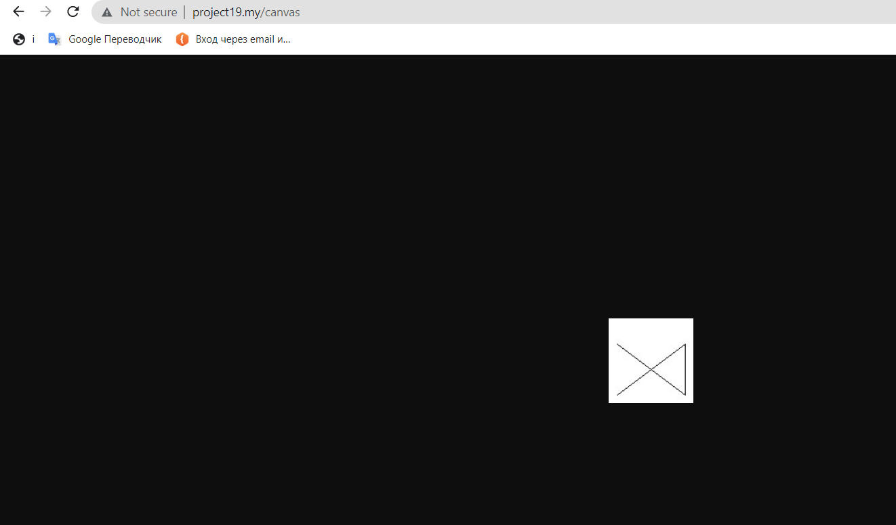

## Домашнее задание № 19.

- При помощи командной строки созданы символьные ссылки images и storage
- В FileController создал тестовый метод index в котором попробовал получить содержимое файла, получить путь файла
- Попробовал записать файлы на разные диски local и s3, но не совсем это получилось походу.
- Прямо в методе routes\web загрузил аватар размером 100х100
- нарисовал картинку
- 

# Домашнее задание 19.

#### 1. При помощи консольных команд создайте символьную ссылку.
#### 2. Напишите методы, которые позволят, например, получить содержимое файла; определить существование файла; скачать файл.
#### 3. Реализуйте сохранение файлов на разные диски. Например, новости сохраняются на диск news, а посты на диск posts.
#### 4. Установите пакет Intervention Image и реализуйте обработку изображений, например, аватары, загружаемые пользователем, должны сохраняться с разрешением не больше 100x100.
#### 5. Творческое задание. Используя возможности Intervention Image нарисуйте простое изображение

 

 
